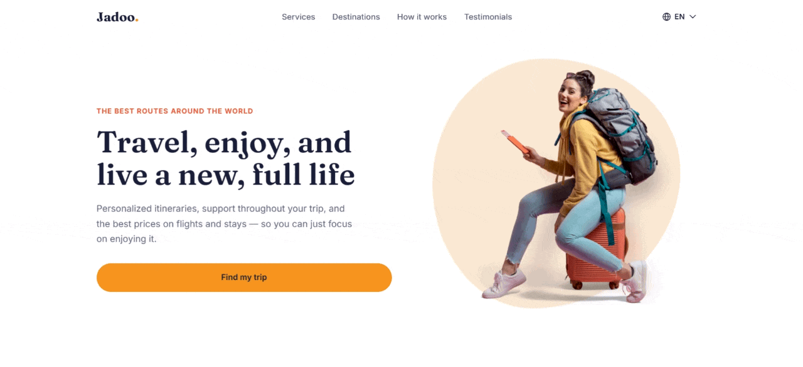

# Jadoo Viagens — Travel Agency Landing Page

A landing page for a fictitious travel agency (**Jadoo**).



## 🛠️ Tech stack

| Category            | Technology |
| -------------------- | ---------- |
| Framework            | [React 19](https://react.dev/) |
| Build tool            | [Vite 8](https://vite.dev/) |
| Language              | [TypeScript](https://www.typescriptlang.org/) |
| Styling               | [Sass](https://sass-lang.com/) (CSS Modules per component) |
| Internationalization  | [i18next](https://www.i18next.com/) + [react-i18next](https://react.i18next.com/) + [i18next-browser-languagedetector](https://github.com/i18next/i18next-browser-languageDetector) |
| Typography            | Self-hosted variable fonts via [Fontsource](https://fontsource.org/) (`Fraunces` for headings, `Inter` for body text) |
| Animations             | [Intersection Observer API](https://developer.mozilla.org/en-US/docs/Web/API/Intersection_Observer_API) (scroll detection, via a custom `useInView` hook) + native CSS `@keyframes`/`animation` (no animation library) |
| Lint                  | [oxlint](https://oxc.rs/) |

No CSS framework (Tailwind, Bootstrap, etc.) is used. 

## 📁 Project structure

```
src/
├── assets/images/         
├── components/
│   ├── ui/                
│   │   (Button, Container, IconBadge, IconButton,
│   │    LanguageSwitcher, SectionHeading)
│   ├── layout/             
│   ├── sections/           
│   │   (Hero, Services, Destinations, BookTrip,
│   │    Testimonials, PartnerLogos, Newsletter)
│   └── icons/              
├── data/                   # Typed content arrays/objects
│                            # (destinations, services, testimonials, nav...)
├── hooks/
│   └── useInView.ts        # IntersectionObserver hook powering scroll reveals
├── i18n/
│   ├── config.ts           # i18next configuration
│   └── locales/            # Translation files (pt.json, en.json, es.json)
├── styles/
│   ├── _tokens.scss        
│   ├── _mixins.scss       
│   ├── _reset.scss         
│   └── global.scss         
├── App.tsx                 # Composes the page sections
├── main.tsx                # Entry point (mounts React, imports fonts/i18n)
└── types.ts                # Shared types
```

Each component ships with its own `Component.module.scss` file — CSS
Modules, no styling framework.

## 🌍 Internationalization (i18n)

The project supports **3 languages**: **Portuguese (pt)**, **English (en)**
and **Spanish (es)**, with **Portuguese as the default/fallback language**.

### How it works

1. **Library**: internationalization is handled with `i18next` +
   `react-i18next`. All configuration are in
   [`src/i18n/config.ts`](src/i18n/config.ts), which is imported in
   [`src/main.tsx`](src/main.tsx), before `<App />` is rendered to ensure that when it is rendered, languages import is already loaded.

2. **Translation files**: each language has its own JSON file in
   `src/i18n/locales/` (`pt.json`, `en.json`, `es.json`), sharing the same
   keys nested by section (`hero.title`, `services.eyebrow`,
   `footer.rights`, etc.). All three are loaded as i18next resources at
   startup.

3. **Usage in components**: every component that renders text uses the
   `useTranslation()` hook from `react-i18next` and looks up strings by
   key:

   ```tsx
   const { t } = useTranslation()
   <h1>{t('hero.title')}</h1>
   ```

4. **Automatic language detection**: the
   `i18next-browser-languagedetector` plugin detects the user's preferred
   language on first visit, in this priority order:
   - a language previously saved in `localStorage` (key `jadoo-language`);
   - the browser's language (`navigator.language`);
   - `pt` as the final fallback, if nothing else matches a supported
     language.

5. **Manual language switching**: the
   [`LanguageSwitcher`](src/components/ui/LanguageSwitcher/LanguageSwitcher.tsx)
   component, in the Header, shows a menu with the PT/EN/ES options
   (defined in [`src/data/languages.ts`](src/data/languages.ts)). Selecting
   a language calls `i18n.changeLanguage(...)`, which:
   - automatically re-renders every component using `useTranslation()`
     with the new language;
   - persists the choice to `localStorage`.

6. **Document sync**: a listener on i18next's `languageChanged` event (in
   `src/i18n/config.ts`) keeps `<html lang="...">` and the page
   `<title>`/`<meta name="description">` in sync with the active
   language. That's for both SEO and assistive technology as screen
   readers.

7. **Interpolation**: the `escapeValue: false` option is used because React
   already escapes values by default.

### Adding a new translatable string

1. Add the key and the Portuguese text to `src/i18n/locales/pt.json`.
2. Mirror the same key (translated) in `en.json` and `es.json`.
3. Use `t('new.key')` in the component.

### Adding a new language

1. Create `src/i18n/locales/<code>.json` with all existing keys translated.
2. Register the new language in `resources` and `supportedLanguages` in
   [`src/i18n/config.ts`](src/i18n/config.ts).
3. Add the matching entry to
   [`src/data/languages.ts`](src/data/languages.ts) so it shows up in the
   `LanguageSwitcher`.

## 🖼️ Images

Destination photos, testimonial avatars, and the hero image were downloaded
locally (not hotlinked) and optimized as `.webp` where possible, living in
`src/assets/images/`.

## 🎬 Animations

No animation library (Framer Motion, GSAP, AOS, etc.) is used. Scroll
reveals and ambient motion are built purely with the Intersection Observer API and
plain CSS.

1. Scroll detection

2. Reveal-on-scroll

3. Staggering

4. Ambient motion


## 🚀 Running locally

Prerequisite: [Node.js](https://nodejs.org/) installed.

```bash
# install dependencies
npm install

# start the dev server
npm run dev

# production build
npm run build

# preview the production build
npm run preview

# run the linter (oxlint)
npm run lint
```

By default, `npm run dev` serves the app at `http://localhost:5173`.

## ♿ Accessibility and responsiveness

- **Mobile-first** layout, with breakpoints defined in
  `src/styles/_tokens.scss` and applied via the `respond()` mixin.
- Skip link to the main content, `aria-label`s on buttons/icons, focus
  management in the mobile menu and the language switcher.
- Respects `prefers-reduced-motion` for motion-sensitive users.

